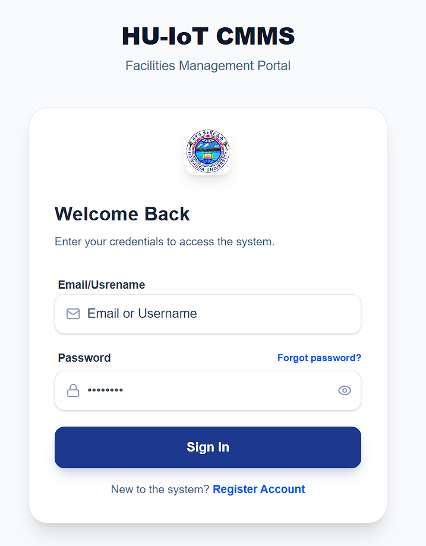
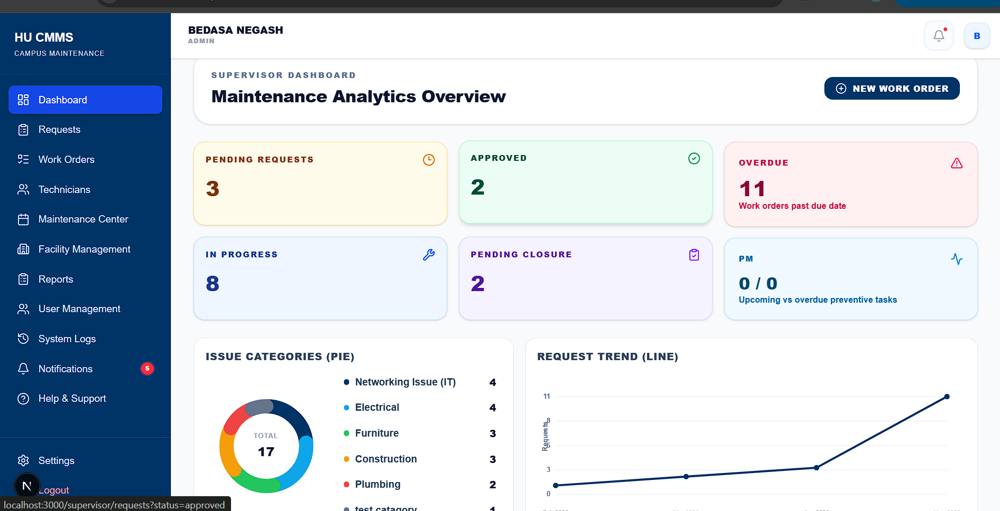
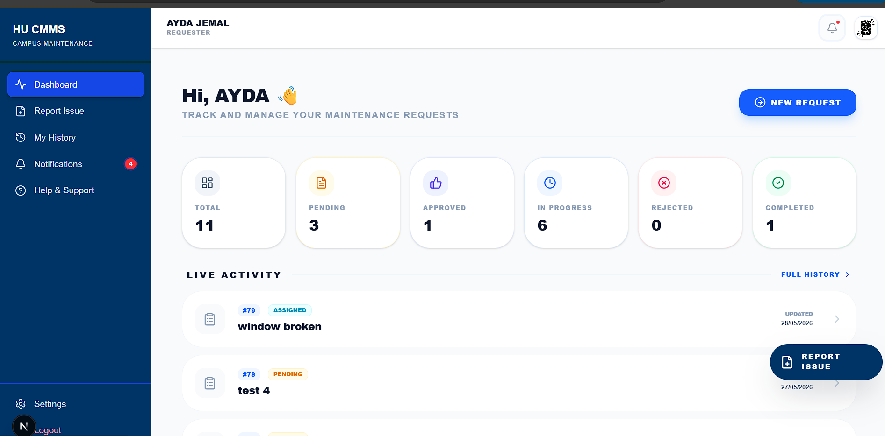
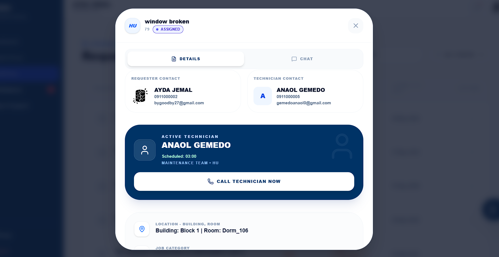
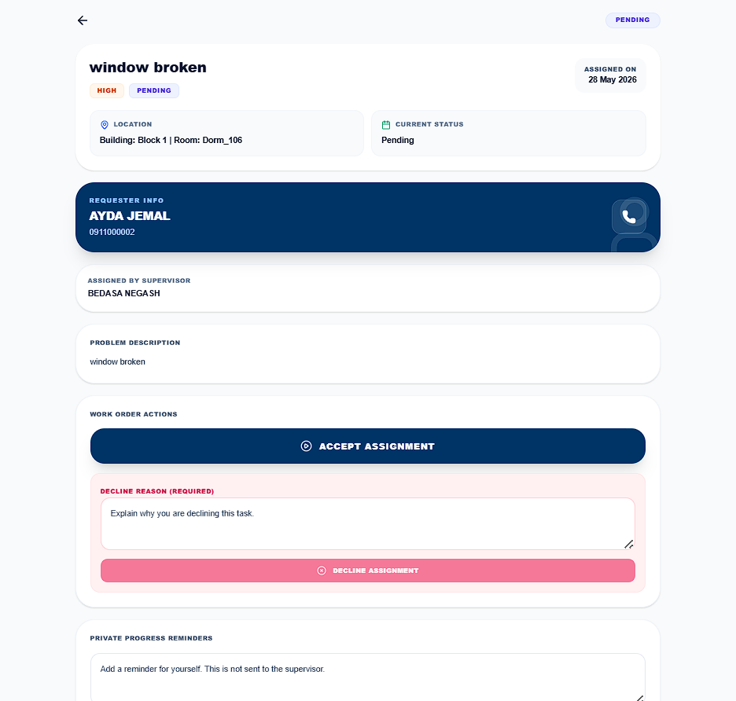
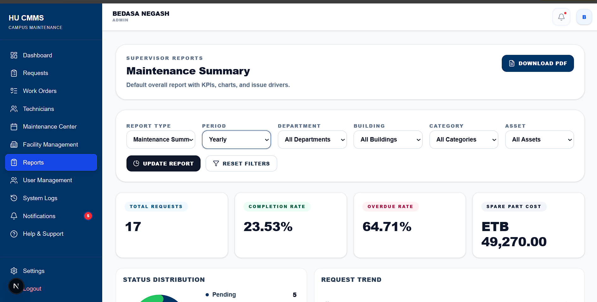

# Campus Maintenance Management System (CMMS)

A web-based Campus Maintenance Management System (CMMS) developed as a final-year Information Systems project. The system helps universities efficiently report, assign, track, and manage maintenance requests across campus.

---

## Problem Statement

Many universities still rely on manual processes such as phone calls, paper forms, or verbal communication to report maintenance issues. This often leads to:

- Lost or forgotten maintenance requests
- Slow response times
- Poor communication between departments
- Lack of maintenance history
- Difficulty tracking completed work
- Limited reporting and analytics

This project digitizes the entire maintenance workflow.

---

## Features

### User Features

- User authentication and authorization
- Report maintenance issues
- Upload images of damaged equipment
- Track request status
- View maintenance history
- Receive status updates

### Technician Features

- View assigned tasks
- Update work progress
- Complete maintenance requests
- Add maintenance notes

### Admin Features

- Manage users
- Manage departments
- Assign technicians
- Monitor maintenance requests
- View dashboard statistics
- Generate reports

---

## Tech Stack

### Frontend

- Next.js
- Tailwind CSS
  
### Backend

- Laravel 12
- PHP 8.2

### Database

- MySQL

### Development Tools

- VS Code
- Git & GitHub
- Composer
- npm

---

## System Workflow

1. User reports a maintenance issue.
2. Admin reviews the request.
3. Admin assigns a technician.
4. Technician performs the repair.
5. Technician updates the request status.
6. User can track progress until completion.

---

## Project Structure

```
frontend/
backend/
README.md
```

---

## Installation

### Clone the repository

```bash
git clone https://github.com/yourusername/campus-maintenance-management-system.git
```

---

## Backend Setup (Laravel)

```bash
cd backend

composer install

cp .env.example .env

php artisan key:generate

php artisan migrate

php artisan serve
```

---

## Frontend Setup (Next.js)

```bash
cd frontend

npm install

npm run dev
```

---

## Environment Variables

Backend (`.env`)

```
DB_DATABASE=cmms
DB_USERNAME=root
DB_PASSWORD=
```

Frontend (`.env.local`)

```
NEXT_PUBLIC_API_URL=http://localhost:8000/api
```

---

## Future Improvements

- SMS notifications
- QR code asset tracking
- Mobile application
- Predictive maintenance using AI
- Equipment inventory integration
- IoT integration

---

## Author

**Bedasa Negash**

Bachelor of Science in Information Systems

Hawassa University

2026

---

## Screenshots

### Login Page



---

### Dashboard



---

### Requester Dashboard




---

### Technician Dashboard



---

### Report Page




